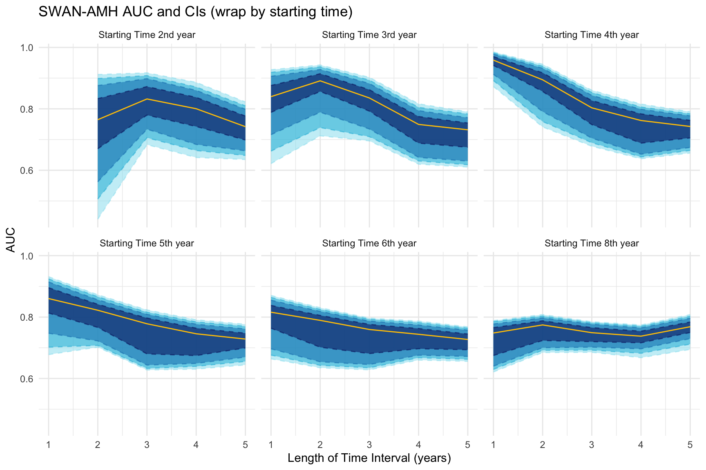

```{r setup, include=FALSE}
knitr::opts_chunk$set(
	echo = FALSE,
	error = FALSE,
	message = FALSE,
	comment = "#>",
	digits = 4,
	warnings = FALSE
)
## clean the R environment
# graphics.off()
# rm(list = ls())
# freshr::freshr()

## load packages
library(here, quietly = TRUE)
library(tidyverse, quietly = TRUE)
library(gtsummary, quietly = TRUE)
library(flextable, quietly = TRUE)
library(JMbayes2, quietly = TRUE)
devtools::load_all()

## check the directory for the file
# here::dr_here()
here::set_here()

## the figure or results should be saved 
# paste0("foldername/Sfilename_workingresult_", 
#      Sys.Date(), ".filetype")
```

```{r}
load("data/swan_amh03.rda")
load("data/swan_amh13.rda")

swan_amh04 <- swan_amh03 %>%
  group_by(id) %>%
  arrange(time) %>%
  slice(1L) %>%
  dplyr::select(id, lamh0 = lamh) %>%
  mutate(id = as.character(id))

swan_amh03 <- swan_amh03 %>%
  mutate(id = as.character(id)) %>%
  full_join(swan_amh04, by = "id") %>%
  mutate(bmi_cat = case_when(bmi < 25 ~ 1,
                             bmi >= 25 & bmi < 30 ~ 2,
                             bmi >= 30 ~ 3),
         bmi_cat = as.factor(bmi_cat))

swan_amh13 <- swan_amh13 %>%
  full_join(swan_amh04, by = "id") %>%
  mutate(bmi_cat = case_when(bmi < 25 ~ 1,
                             bmi >= 25 & bmi < 30 ~ 2,
                             bmi >= 30 ~ 3),
         bmi_cat = as.factor(bmi_cat))

# levels(swan_amh13$alcohol)
# levels(swan_amh13$edu)
# table(swan_amh13$bmi_cat)
# table(swan_amh03$bmi_cat)
```

## Model119

$$
\begin{split}
  jmb2.119.value.rate: & \\ 
  lme1: \ \ \  & \pmb m(time) = (fixed = lamh \sim time,\\
  & \ \ \ \ \ \ \ \ \ \ \ \ \ \ \ \  \ \ \ \ \ \  random = time| id) \\
  surv19: \ \ \ & Surv(etime, event) \sim  factor(bmi) + site + ethnic + smoke \\
  & \ \ \ \ \ \ \ \ \ \ \ \ \ \ \ \ \ \ \ \ \ \ \ \ \ \ \ \ \ \ \ \ \ \ \ \ \ \ + \pmb m(time) + \pmb m'(time) 
\end{split}
$$

```{r}
load("results/jmb2_119_chain5_it500k_thin100_total25k.Rdata")

summary <- summary(jmb2.119.value.rate)
```

## Function for AUC CI

This is function modified from Dimitris Rizopoulos' `tvAUC.jm()` function. The function is used to calculate the AUC and its confidence interval. The function is modified to work with the `jm` object from the `JMbayes2` package.

The function is conditional on the `Tstart` and `Dt` arguments for each setup. After we set up the `Tstart` and `Dt`, the new dataset will be generated to include the individuals who have not experienced the event yet but having longitudinal outcomes before the `Tstart` + `Dt`. We pull out every single iteration of `mcmc` object from the `predict()` function and calculate the AUC for that iteration.

argument `iter` is the number of iterations to calculate the AUC.

Then we can calculate the quantiles of the re-sampling AUCs to get the confidence interval.


```{r}
#| eval: false
#| include: true

AUCs2  <- map(c(2, 3, 4, 5), 
             ~try(tvROC(jmb2.119.value.rate,
                           swan_amh03,
                           Tstart = 2,
                           Dt = .x)))

AUCs3  <- map(c(2, 3, 4, 5), 
             ~try(tvROC(jmb2.119.value.rate,
                           swan_amh03,
                           Tstart = 3,
                           Dt = .x)))

AUCs4  <- map(c(1, 2, 3, 4, 5), 
             ~try(tvROC(jmb2.119.value.rate,
                           swan_amh03,
                           Tstart = 4,
                           Dt = .x)))

AUCs5  <- map(c(1, 2, 3, 4, 5), 
             ~try(tvROC(jmb2.119.value.rate,
                           swan_amh03,
                           Tstart = 5,
                           Dt = .x)))

AUCs6  <- map(c(1, 2, 3, 4, 5), 
             ~try(tvROC(jmb2.119.value.rate,
                           swan_amh03,
                           Tstart = 6,
                           Dt = .x)))

AUCs8  <- map(c(1, 2, 3, 4, 5), 
             ~try(tvROC(jmb2.119.value.rate,
                           swan_amh03,
                           Tstart = 8,
                           Dt = .x)))

save(AUCs2, AUCs3, AUCs4, AUCs5, AUCs6, AUCs8,
     file = "results/jmb2_119_freq_ci_chain5_it500k_thin100_total25k.Rdata.RData")


# AUC2_ci <- map_dfc(AUCs2, "auc") %>% 
#   map_dfr(~quantile(.x, c(0.5, 0.025, 0.975))) %>% 
#   round(digit = 3) %>%
#   unite(col = "95% CI", c("2.5%", "97.5%"), sep = " , ") %>%
#   mutate(`95% CI` = paste0("(", `95% CI`, ")")) %>%
#   unite(col = "AUC", c("50%", "95% CI"), sep = "  ") 
# 
# AUC3_ci <- map_dfc(AUCs3, "auc") %>%
#   map_dfr(~quantile(.x, c(0.5, 0.025, 0.975))) %>%
#   round(digit = 3) %>%
#   unite(col = "95% CI", c("2.5%", "97.5%"), sep = " , ") %>%
#   mutate(`95% CI` = paste0("(", `95% CI`, ")")) %>%
#   unite(col = "AUC", c("50%", "95% CI"), sep = "  ") 
# 
# AUC4_ci <- map_dfc(AUCs4, "auc") %>%
#   map_dfr(~quantile(.x, c(0.5, 0.025, 0.975))) %>%
#   round(digit = 3) %>%
#   unite(col = "95% CI", c("2.5%", "97.5%"), sep = " , ") %>%
#   mutate(`95% CI` = paste0("(", `95% CI`, ")")) %>%
#   unite(col = "AUC", c("50%", "95% CI"), sep = "  ") 
# 
# AUC5_ci <- map_dfc(AUCs5, "auc") %>%
#   map_dfr(~quantile(.x, c(0.5, 0.025, 0.975))) %>%
#   round(digit = 3) %>%
#   unite(col = "95% CI", c("2.5%", "97.5%"), sep = " , ") %>%
#   mutate(`95% CI` = paste0("(", `95% CI`, ")")) %>%
#   unite(col = "AUC", c("50%", "95% CI"), sep = "  ") 
# 
# AUC6_ci <- map_dfc(AUCs6, "auc") %>%
#   map_dfr(~quantile(.x, c(0.5, 0.025, 0.975))) %>%
#   round(digit = 3) %>%
#   unite(col = "95% CI", c("2.5%", "97.5%"), sep = " , ") %>%
#   mutate(`95% CI` = paste0("(", `95% CI`, ")")) %>%
#   unite(col = "AUC", c("50%", "95% CI"), sep = "  ") 
# 
# AUC8_ci <- map_dfc(AUCs8, "auc") %>%
#   map_dfr(~quantile(.x, c(0.5, 0.025, 0.975))) %>%
#   round(digit = 3) %>%
#   unite(col = "95% CI", c("2.5%", "97.5%"), sep = " , ") %>%
#   mutate(`95% CI` = paste0("(", `95% CI`, ")")) %>%
#   unite(col = "AUC", c("50%", "95% CI"), sep = "  ") 


# AUC2_ci <- rbind(NA, AUC2_ci)
# 
# AUC_final <- cbind(AUC2_ci, AUC3_ci,
#                    AUC4_ci, AUC5_ci, 
#                    AUC6_ci, AUC8_ci) 
# colnames(AUC_final) <- c("Tstart2", "Tstart3", "Tstart4", "Tstart5", "Tstart6", "Tstart8")
# 
# AUC_final <- t(AUC_final)
# 
# colnames(AUC_final) <- c("Dt1", "Dt2", "Dt3", "Dt4", "Dt5")

```

```{r}
load("results/jmb2_119_freq_ci_chain5_it500k_thin100_total25k.Rdata.RData")
load("results/jmb2_119_auc_chain5_it500k_thin100_total25k.Rdata")

tbl_auc_value_rate %>% knitr::kable()
```

For the final table each column is different `Dt` time window for predicting in $1, 2, 3, 4, 5$ years;
each row is the `Tstart` time window for starting from the $2, 3, 4, 5, 6, 8$-th years. 

Each cell is the AUC with 95% CI in the parenthesis `median (95% CI)`.

```{r}
AUC_final %>% 
  knitr::kable() %>%
  kableExtra::kable_styling(font_size = 8)

```

-   [x] `r praise::praise()`

## AUC plot

```{r}
# AUC2_ci <- map_dfc(AUCs2, "auc") %>%
#   map_dfr(~ quantile(.x, c(0.5, 0.025, 0.05, 0.1, 0.25, 0.75, 0.9, 0.95, 0.975))) %>%
#   mutate(Tstart = 2)
# AUC3_ci <- map_dfc(AUCs3, "auc") %>%
#   map_dfr(~ quantile(.x, c(0.5, 0.025, 0.05, 0.1, 0.25, 0.75, 0.9, 0.95, 0.975)))%>%
#   mutate(Tstart = 3)
# AUC4_ci <- map_dfc(AUCs4, "auc") %>%
#   map_dfr(~ quantile(.x, c(0.5, 0.025, 0.05, 0.1, 0.25, 0.75, 0.9, 0.95, 0.975)))%>%
#   mutate(Tstart = 4)
# AUC5_ci <- map_dfc(AUCs5, "auc") %>%
#   map_dfr(~ quantile(.x, c(0.5, 0.025, 0.05, 0.1, 0.25, 0.75, 0.9, 0.95, 0.975)))%>%
#   mutate(Tstart = 5)
# AUC6_ci <- map_dfc(AUCs6, "auc") %>%
#   map_dfr(~ quantile(.x, c(0.5, 0.025, 0.05, 0.1, 0.25, 0.75, 0.9, 0.95, 0.975)))%>%
#   mutate(Tstart = 6)
# AUC8_ci <- map_dfc(AUCs8, "auc") %>%
#   map_dfr(~ quantile(.x, c(0.5, 0.025, 0.05, 0.1, 0.25, 0.75, 0.9, 0.95, 0.975)))%>%
#   mutate(Tstart = 8)

# AUC2_ci <- rbind(NA, AUC2_ci) %>%
#   mutate(Tstart = 2)

# View(AUC2_ci)

AUC_final <- cbind(AUC2_ci, AUC3_ci,
                   AUC4_ci, AUC5_ci, 
                   AUC6_ci, AUC8_ci) %>%
  mutate(Dt = c(2:5, rep(1:5, 5)))

AUC_final <- rbind(AUC2_ci, AUC3_ci,
                   AUC4_ci, AUC5_ci, 
                   AUC6_ci, AUC8_ci) %>%
  mutate(Dt = c(2:5, rep(1:5, 5)))
```

### AUC and CI by Tstart

```{r}
#| fig_height: 6
#| fig_width: 9
## color codes for the palette
# Hex Codes: #355070 // #6d597a // #b56576 // #e56b6f // #eaac8b
# Hex Codes: #03045e // #0077b6 // #00b4d8 // #90e0ef // #caf0f8
# auc_plot <-
AUC_final %>%
  ggplot() +
  geom_line(aes(x = Dt, y = `2.5%`, group = Tstart),
              color = "#90e0ef", linetype = "dashed",
              alpha = 0.5) +
    geom_line(aes(x = Dt, y = `97.5%`, group = Tstart),
              color = "#90e0ef", linetype = "dashed",
              alpha = 0.5) +
    geom_ribbon(aes(x = Dt, 
                    ymin = `2.5%`, 
                    ymax = `97.5%`,
                    group = Tstart),
                fill = "#90e0ef",
                alpha = 0.5) +
  geom_line(aes(x = Dt, y = `5%`, group = Tstart),
              color = "#00b4d8", linetype = "dashed",
              alpha = 0.5) +
    geom_line(aes(x = Dt, y = `95%`, group = Tstart),
              color = "#00b4d8", linetype = "dashed",
              alpha = 0.5) +
    geom_ribbon(aes(x = Dt, 
                    ymin = `5%`, 
                    ymax = `95%`,
                    group = Tstart),
                fill = "#00b4d8",
                alpha = 0.5) +
    geom_line(aes(x = Dt, y = `10%`, group = Tstart),
              color = "#0077b6", linetype = "dashed",
              alpha = 0.5) +
    geom_line(aes(x = Dt, y = `90%`, group = Tstart),
              color = "#0077b6", linetype = "dashed",
              alpha = 0.5) +
    geom_ribbon(aes(x = Dt, 
                    ymin = `10%`, 
                    ymax = `90%`,
                    group = Tstart),
                fill = "#0077b6",
                alpha = 0.5) +
    geom_line(aes(x = Dt, y = `25%`, group = Tstart),
              color = "#03045e", linetype = "dashed",
              alpha = 0.5) +
    geom_line(aes(x = Dt, y = `75%`, group = Tstart),
              color = "#03045e", linetype = "dashed",
              alpha = 0.5) +
    geom_ribbon(aes(x = Dt, 
                    ymin = `25%`, 
                    ymax = `75%`,
                    group = Tstart),
                fill = "#03045e",
                alpha = 0.5) +
  geom_line(aes(x = Dt, y = `50%`, group = Tstart),
              color = "#fdc500", 
              linewidth = 0.5) +
  facet_wrap(~Tstart,
             labeller = labeller(
               Tstart = c("2" = "Starting Time 2nd year",
                          "3" = "Starting Time 3rd year",
                          "4" = "Starting Time 4th year",
                          "5" = "Starting Time 5th year",
                          "6" = "Starting Time 6th year",
                          "8" = "Starting Time 8th year"))) +
  labs(title = "SWAN-AMH AUC and CIs (wrap by starting time)") +
  theme_minimal() +
  xlab("Length of Time Interval (years)") +
  ylab("AUC") +
  theme(legend.position = "none",
        # panel.grid = element_blank(),
        # plot.margin = margin(t = 20, b = 8),
        # axis.text = element_blank(),
        # axis.title = element_blank(),
        strip.text = element_text(hjust = 0.5,
                                  lineheight = 0.1))
```

### AUC and CI by Dt

```{r}
#| fig_height: 6
#| fig_width: 6
# Hex Codes: #355070 // #6d597a // #b56576 // #e56b6f // #eaac8b
# Hex Codes: #03045e // #0077b6 // #00b4d8 // #90e0ef // #caf0f8
# auc_plot <-
AUC_final %>%
  filter(Dt != 1) %>%
  ggplot() +
  geom_line(aes(x = Tstart, y = `2.5%`, group = Dt),
              color = "#90e0ef", linetype = "dashed",
              alpha = 0.5) +
    geom_line(aes(x = Tstart, y = `97.5%`, group = Dt),
              color = "#90e0ef", linetype = "dashed",
              alpha = 0.5) +
    geom_ribbon(aes(x = Tstart, 
                    ymin = `2.5%`, 
                    ymax = `97.5%`,
                    group = Dt),
                fill = "#90e0ef",
                alpha = 0.5) +
  geom_line(aes(x = Tstart, y = `5%`, group = Dt),
              color = "#00b4d8", linetype = "dashed",
              alpha = 0.5) +
    geom_line(aes(x = Tstart, y = `95%`, group = Dt),
              color = "#00b4d8", linetype = "dashed",
              alpha = 0.5) +
    geom_ribbon(aes(x = Tstart, 
                    ymin = `5%`, 
                    ymax = `95%`,
                    group = Dt),
                fill = "#00b4d8",
                alpha = 0.5) +
    geom_line(aes(x = Tstart, y = `10%`, group = Dt),
              color = "#0077b6", linetype = "dashed",
              alpha = 0.5) +
    geom_line(aes(x = Tstart, y = `90%`, group = Dt),
              color = "#0077b6", linetype = "dashed",
              alpha = 0.5) +
    geom_ribbon(aes(x = Tstart, 
                    ymin = `10%`, 
                    ymax = `90%`,
                    group = Dt),
                fill = "#0077b6",
                alpha = 0.5) +
    geom_line(aes(x = Tstart, y = `25%`, group = Dt),
              color =  "#03045e", linetype = "dashed",
              alpha = 0.5) +
    geom_line(aes(x = Tstart, y = `75%`, group = Dt),
              color = "#03045e", linetype = "dashed",
              alpha = 0.5) +
    geom_ribbon(aes(x = Tstart, 
                    ymin = `25%`, 
                    ymax = `75%`,
                    group = Dt),
                fill = "#03045e",
                alpha = 0.5) +
  geom_line(aes(x = Tstart, y = `50%`, group = Dt),
              color = "#ffd500", 
              linewidth = 0.5) +
  facet_wrap(~Dt,
             labeller = labeller(
               Dt = c("1" = "1-year Time Interval",
                      "2" = "2-year Time Interval",
                      "3" = "3-year Time Interval",
                      "4" = "4-year Time Interval",
                      "5" = "5-year Time Interval"))) +
  labs(title = "SWAN-AMH AUC and CIs (wrap by time interval)") +
  theme_minimal() +
  xlab("Starting Time (year)") +
  ylab("AUC") +
  theme(legend.position = "none",
        # panel.grid = element_blank(),
        # plot.margin = margin(t = 20, b = 8),
        # axis.text = element_blank(),
        # axis.title = element_blank(),
        strip.text = element_text(hjust = 0.5,
                                  lineheight = 0.1))
```

### AUC only

```{r}
#| label: auc_plot
#| warning: false
#| fig-cap: "AUC plot for SWAN-AMH Tstart"

auc_tstart <- AUC_final %>%
  mutate(Tstart = as.character(Tstart)) %>%
  ggplot() +
  geom_line(aes(x = Dt, y = `50%`,
                group = Tstart, 
                color = Tstart),
              linewidth = 1) +
  geom_point(aes(x = Dt, y = `50%`,
                group = Tstart, 
                color = Tstart),
              size = 2.5) +
  geom_point(aes(x = Dt, y = `50%`,
                group = Tstart),
              color = "white",
              size = 1,
             alpha = 0.5) +
  labs(title = "SWAN-AMH AUC") +
  theme_minimal() +
  xlab("Length of Time Interval (years)") +
  ylab("AUC") +
  ggthemes::scale_colour_tableau("Jewel Bright") +
  theme(legend.position = c(0.90, 0.66),
        # legend.background = element_rect(fill = "#C9C9C9", 
        #                           size = 0.5,
        #                           color = "#C9C9C9"),
        # plot.background = element_rect(fill = "#C9C9C9",
        #                                color = "#C9C9C9"),
        # panel.grid = element_blank(),
        # plot.margin = margin(t = 20, b = 8),
        # axis.text = element_blank(),
        # axis.title = element_blank(),
        strip.text = element_text(hjust = 0.5,
                                  lineheight = 0.1))
# c("c("#D9D9D9", "#C9C9C9", "#E5E5E5")", "#FFFFFF", "#FFFFFF")
```

```{r}
#| label: auc_plot2
#| warning: false
#| fig-cap: "AUC plot for SWAN-AMH Dt"


auc_dt <- AUC_final %>%
  mutate(Dt = as.character(Dt)) %>%
  ggplot() +
  geom_line(aes(x = Tstart, y = `50%`,
                group = Dt, 
                color = Dt),
              linewidth = 1) +
  geom_point(aes(x = Tstart, y = `50%`,
                group = Dt, 
                color = Dt),
              size = 2.5) +
  geom_point(aes(x = Tstart, y = `50%`,
                group = Dt),
              color = "white",
              size = 1,
             alpha = 0.5) +
  labs(title = "SWAN-AMH AUC") +
  theme_minimal() +
  xlab("Start Time (year)") +
  ylab("AUC") +
  ggthemes::scale_colour_tableau("Jewel Bright") +
  theme(legend.position = c(0.88, 0.60),
        # legend.background = element_rect(fill = "#C9C9C9", 
        #                           size = 0.5,
        #                           color = "#C9C9C9"),
        # plot.background = element_rect(fill = "#C9C9C9",
        #                                color = "#C9C9C9"),
        # panel.grid = element_blank(),
        # plot.margin = margin(t = 20, b = 8),
        # axis.text = element_blank(),
        # axis.title = element_blank(),
        strip.text = element_text(hjust = 0.5,
                                  lineheight = 0.1))
# c("c("#D9D9D9", "#C9C9C9", "#E5E5E5")", "#FFFFFF", "#FFFFFF")
```

```{r fig.show="hold", out.width="100%"}
#| layout-ncol: 2
auc_tstart
auc_dt
```

## Comparison for `jm117.value.rate` to `jm119.value.rate`

```{r fig.show="hold", out.width="100%"}
#| layout-ncol: 2
# 
# 
# knitr::include_graphics("figure/Q18_jm119_value_rate_auc_plot.png")

```
